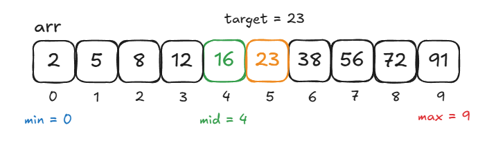

# Binary Search

**Binary Search** is an efficient searching algorithm used to find the position of a target element in a **sorted array** or list. It works by repeatedly dividing the search interval in half and comparing the target value with the middle element of the array. If the target value is smaller, it eliminates the right (greater) half of the search space; if larger, it eliminates the left (smaller) half. The process is repeated until the target value is found or the search space is empty.

The process of **Binary Search** can be summarized in the following steps:

1. **Sort the Array (Precondition)**: The algorithm requires the input array or list to be sorted. If the array is not sorted, **Binary Search** will not work correctly.

2. **Set Low & High Pointers**: Initialize a `low` pointer to the first element of the array and a `high` pointer to the last element of the array.

3. **Find the Midpoint**: Calculate the middle index `mid` as the average of `low` and `high`: `mid = (low + high) // 2`.

4. **Compare the Mid Element with Target**:
   - If the middle element is the target, return its index.
   - If the middle element is _less than_ the target, update `low` to `mid + 1` (search only in the right half).
   - If the middle element is _greater than_ the target, update `high` to `mid - 1` (search only in the left half).

5 **Repeat Until Found or Exhausted**: Repeat the process until the target element is found or `low` is greater than `high`. Return the index of the target element or a failure indicator if the target element is not found.

## Time & Space Complexity

| Complexity       | Best Case | Average Case | Worst Case  |
| ---------------- | --------- | ------------ | ----------- |
| Time Complexity  | $O(1)$    | $O(log(n))$  | $O(log(n))$ |
| Space Complexity | $O(1)$    | -            | -           |

### Explanation

- **Time Complexity**: In the best case, **Binary Search** has a time complexity of $O(1)$ if the target is found at the first midpoint. In average and worst case, the algorithm has a time complexity of $O(log (n))$, because the search space is _halved_ with each iteration.
- **Space Complexity**: The algorithm only uses constant space $O(1)$ to store a few variables for the search bounds and middle index. However, the recursive implementation of **Binary Search** uses $O(n)$ space if we consider the recursive call stack.

## Example

Let's use **Binary Search** to find the value `23` in the _sorted_ array `arr = [2, 5, 8, 12, 16, 23, 38, 56, 72, 91]`.

### First Iteration

On the first iteration of binary search, we set `min` equal to the first index `0`, `max` equal to the last index `9`, and `mid` to our midpoint at index `4`. Since our target element `23` is greater than `arr[mid]` (which is equal yo `16`), we eliminate the smaller half of the search space and focus on the greater half, since we know that our target element must be in the greater half of the search space if it exists.



### Second Iteration

On the second iteration, we have `min = 5`, `mid = 7`, and `max = 9`. Since `arr[mid] = 56`, we can again eliminate half of the search space and focus on the smaller half.


### Third Iteration

On the third and final iteration of **Binary Search**, we have `min = 5`, `mid = 5`, and `max = 6`. Finally, we've found our target value `23` at `mid`, so we return the index `5` and stop the search.


## Iterative Implementation (Python)

```python
def binary_search(arr, target):
    low = 0
    high = len(arr) - 1

    # Iterate while the search space is valid
    while low <= high:
        mid = (low + high) // 2  # Find the middle element

        # If target is found, return the index
        if arr[mid] == target:
            return mid
        # If the target is greater, ignore the left half
        elif arr[mid] < target:
            low = mid + 1
        # If the target is smaller, ignore the right half
        else:
            high = mid - 1

    return -1  # Target not found
```

## Recursive Implementation (Python)

```python
def binary_search_recursive(arr, target, low, high):
    if low > high:
        return -1  # Target not found

    mid = (low + high) // 2  # Find the middle element

    if arr[mid] == target:
        return mid
    elif arr[mid] < target:
        return binary_search_recursive(arr, target, mid + 1, high)  # Search in the right half
    else:
        return binary_search_recursive(arr, target, low, mid - 1)  # Search in the left half
```

## Characteristics of Binary Search

- **Requires a Sorted Array**: This algorithm requires the input array to be sorted. Sorting the array first (if needed) would add an additional time complexity of $O(n * log(n))$.

- **Efficient for Large Datasets**: Because **Binary Search** works by halving the search space at each step, its time complexity is logarithmic, making it very efficient for large datasets. Even with millions of elements, Binary Search can quickly find the target element.

- **Iterative or Recursive Implementation**: This algorithm can be implemented both iteratively or recursively, however, the recursive approach requires additional stack space.

- **Logarithmic Performance**: With each iteration, **Binary Search** halves the search space, making it one of the fastest search algorithms for sorted data.

## References

- [Geeks for Geeks Binary Search Algorithm – Iterative and Recursive Implementation](https://www.geeksforgeeks.org/binary-search/)
