# Breadth First Search (BFS)

**Breadth First Search (BFS)** is a fundamental tree and graph traversal algorithm that explores nodes level by level. Unlike **Depth First Search (DFS)**, which explores as deep as possible down each branch before backtracking, **BFS** explores all neighbors of a node before moving to the next level of neighbors. **BFS** is particularly useful in finding the shortest path in unweighted graphs, solving puzzles like mazes, and discovering connected components.

The process of **BFS** can be summarized in the following steps:

1. **Start at the Root (or Chosen Node)**: Begin at the root node (or any chosen node in the case of graphs).

2. **Use a Queue to Track Nodes**: **BFS** uses a _queue_ data structure (FIFO: First In, First Out) to explore each node's neighbors in the order they were discovered. Start by adding the root node to the queue.

3. **Mark the Node as Visited**: As you visit each node, mark it as visited so that it isn't revisited later (especially important for graphs with cycles).

4. **Visit all Adjacent Nodes**: Dequeue the front node from the queue and visit all of its adjacent nodes (children in the case of trees). Add the adjacent unvisited nodes to the queue.

5. **Repeat Until the Queue is Empty**: Continue visiting and exploring nodes until there are no more nodes to visit, which happens when the queue becomes empty.

## Time & Space Complexity

| Complexity       | Best Case  | Average Case | Worst Case |
| ---------------- | ---------- | ------------ | ---------- |
| Time Complexity  | $O(V + E)$ | $O(V + E)$   | $O(V + E)$ |
| Space Complexity | $O(V)$     | $O(V)$       | $O(V)$     |

### Explanation

- **Time Complexity**: The time complexity of **BFS** is $O(V + E)$, where $V$ is the number of vertices (nodes), and $E$ is the number of edges, because **BFS** explores all vertices and edges exactly once.

- **Space Complexity**: **BFS** requires a queue to store the vertices that need to be processed, and the space complexity is $O(V)$ to accommodate the queue and the list/set of visited nodes.

## BFS for Tree Traversal

In tree traversal, **BFS** explores nodes level by level. Starting at the root node, **BFS** will explore all the nodes at depth 1 (direct children of the root), then all nodes at depth 2 (grandchildren), and so on.

### Example

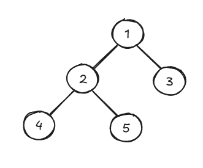

Let's use **BFS** to explore the tree shown in the image above. For the tree shown above, **BFS** will visit the nodes in this order: `1 2 3 4 5`. The algorithm will start by visiting the root node `1`, then the root node's children `2` and `3`, and finally, the root's grandchildren `4` and `5`.

1. We start at the root node `1` and add it to the queue. Next, we remove `1` from the queue to mark it as visited and process its child nodes. Then, we add the child nodes `2` and `3` to the queue.

   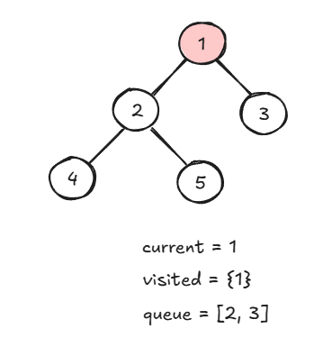

2. Now, we have the nodes `2` and `3` in our queue. We start by removing `2` from the queue, marking it as visited, and enqueueing its child nodes `4` and `5`.

   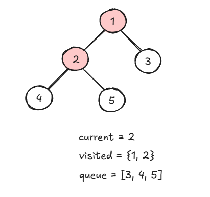

3. Next, we remove `3` from the queue and mark it as visited. Since this node doesn't have any children, there are no nodes to enqueue and we continue processing the queue.

   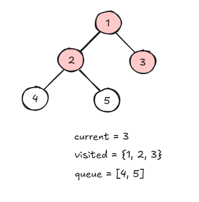

4. Now, we dequeue `4` and mark it as visited. Again, this node doesn't have any children to enqueue, so we continue.

   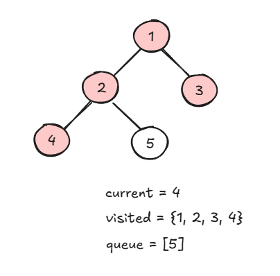

5. Finally, we dequeue `5` and mark it as visited. It has no children, so our **BFS** traversal of the tree is complete. Notice how we processed the nodes of the tree level by level. This is the core functionality of the **BFS** algorithm.

   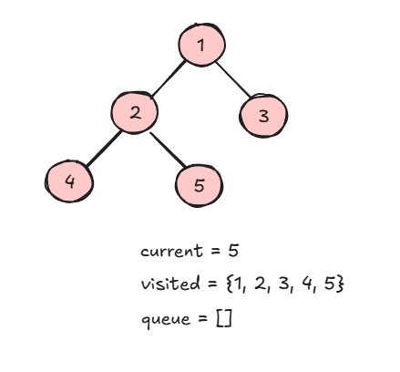

### Implementation (Python)

In this implementation, we will use the `deque` library to make use of the queue data structure in Python. We will also define a `TreeNode` class to create a tree data structure. This implementation of the `TreeNode` class is standard for programming challenges.

```python
from collections import deque

class TreeNode:
    def __init__(self, value):
        self.value = value
        self.left = None
        self.right = None

# BFS for Tree (Level-order Traversal)
def bfs_tree(root):
    if root is None:
        return

    queue = deque([root]) # Initialize queue with root node

    while queue:
        node = queue.popleft() # Process the first node (FIFO)
        print(node.value, end=' ')

        # Enqueue the left child
        if node.left:
            queue.append(node.left)

        # Enqueue the right child
        if node.right:
            queue.append(node.right)


# Example usage
root = TreeNode(1)
root.left = TreeNode(2)
root.right = TreeNode(3)
root.left.left = TreeNode(4)
root.left.right = TreeNode(5)

print("BFS (Level-order Traversal):")
bfs_tree(root)  # Output: 1 2 3 4 5
```

## BFS for Graph Traversal

In graph traversal, **BFS** is used to explore nodes level by level, just like in tree traversal. Starting from a given node, **BFS** explores all of its direct neighbors, then their neighbors, and so on, until all reachable nodes have been visited.

### Example

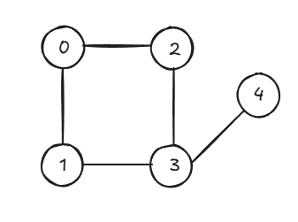

Let's use **BFS** to traverse the graph shown above. For this graph, **BFS** will visit the nodes in this order: `0 1 2 3 4`. We can also represent this graph as an adjacency list in Python:

```python
graph = {
    0: [1, 2],
    1: [0, 3],
    2: [0, 3],
    3: [1, 2, 4],
    4: [3]
}
```

1. First, we start at node `0` and add it to the queue. Then, dequeue `0`, mark it as visited, and enqueue its neighbors `1` and `2`.

   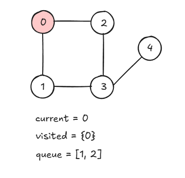

2. Next, we remove `1` from the queue, mark it as visited, and enqueue its unvisited neighbor node `3`.

   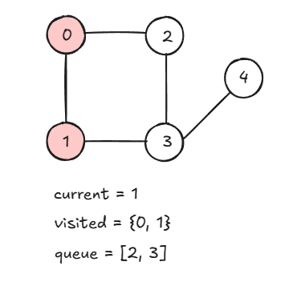

3. Then, we dequeue `2` and mark it as visited. Since `2` does not have any unvisited neighbors, we don't have anything to add to the queue.

   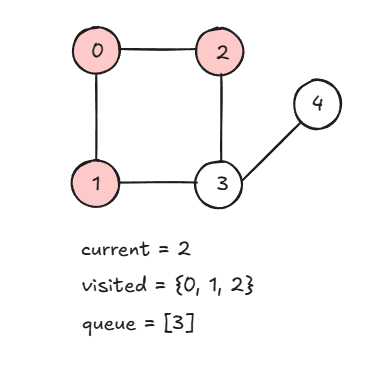

4. Now, we dequeue `3` and mark it as visited. We then add its unvisited neighbor `4` to the queue and continue.

   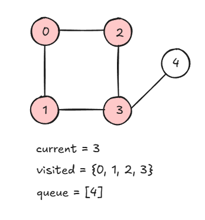

5. Finally, we dequeue `4` and mark it as visited. Since this node doesn't have any unvisited neighbors to add to the queue, our **BFS** traversal is complete. Again, note that in this example, we visit all of a node's neighbors before moving on to the next level and processing its nodes.

   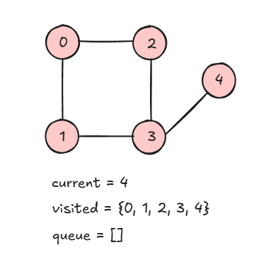

### Implementation (Python)

In this implementation, we again import the `deque` library to utilize the queue data structure in Python. We will also use an adjacency list to represent our graph.

```python
from collections import deque

# BFS for Graphs
def bfs_graph(graph, start):
    visited = set()
    queue = deque([start]) # Initialize queue with starting node

    while queue:
        node = queue.popleft() # Process the first node (FIFO)

        if node not in visited:
            print(node, end=' ')
            visited.add(node)

            # Add all unvisited neighbors to the queue
            for neighbor in graph[node]:
                if neighbor not in visited:
                    queue.append(neighbor)


# Example usage
graph = {
    0: [1, 2],
    1: [0, 3],
    2: [0, 3],
    3: [1, 2, 4],
    4: [3]
}

print("\nBFS Traversal of Graph:")
bfs_graph(graph, 0)  # Output: 0 1 2 3 4
```

## Characteristics of BFS

- **Explores Level by Level**: **BFS** explores all the nodes at the current level before moving on. This makes **BFS** ideal for finding the shortest path in unweighted graphs.

- **Works for Graphs & Trees**: The **BFS** algorithm is applicable to both trees and graphs. In trees, **BFS** is referred to as _level-order traversal_. In graphs, it explores all reachable nodes from the starting node.

- **Queue-Based**: **BFS** relies on the _queue_ data structure (FIFO) to manage the nodes it explores. Nodes are enqueued as they are discovered and dequeued as they are visited.

- **Used in Shortest Path Problems**: **BFS** is particularly useful for finding the shortest path in unweighted graphs, as it explores the nearest nodes first.

- **Avoids Revisiting Nodes**: To prevent infinite loops or redundant visits (cycles in the case of graphs), **BFS** keeps track of all the nodes it has visited previously.

## References

- [Geeks for Geeks - Breadth First Search or BFS for a Graph](https://www.geeksforgeeks.org/breadth-first-search-or-bfs-for-a-graph/)
