# Depth First Search (DFS)

**Depth First Search**, also known as **DFS**, is a fundamental algorithm used to explore or search through trees or graphs. It starts from a given node (called the _root_ node in the case of trees) and explores as far as possible along each branch before backtracking to explore the remaining nodes, making it a "depth-first" approach. **DFS** is particularly useful for tasks like finding connected components, topological sorting, and solving mazes.

**Depth First Search** can be summarized in the following steps:

1. **Start at the Root (or a Chosen Node)**: Begin at the root node (or any arbitrary node) of the graph or tree.

2. **Mark the Node as Visited**: Once a node is visited, mark it to avoid revisiting it. This is especially important in graphs to prevent cycles from being traversed multiple times, but in any traversal, marking nodes helps ensure they aren’t reprocessed.

3. **Explore the Adjacent Nodes**: Recursively explore each of the node's unvisited adjacent nodes (or children in the case of trees) by diving deep along one path. For each adjacent node, apply **DFS** recursively.

4. **Backtrack**: If a node has no unvisited adjacent nodes, backtrack to the previous node and explore any unvisited nodes along that path. Backtracking ensures that DFS thoroughly explores every possible path before considering the next one.

5. **Repeat Until All Nodes are Visited**: The process repeats until all reachable nodes from the starting point have been visited.

## Time & Space Complexity

| Complexity       | Best Case  | Average Case | Worst Case |
| ---------------- | ---------- | ------------ | ---------- |
| Time Complexity  | $O(V + E)$ | $O(V + E)$   | $O(V + E)$ |
| Space Complexity | $O(V)$     | $O(V)$       | $O(V)$     |

### Explanation

- **Time Complexity**: This algorithm has a time complexity of $O(V + E)$, where $V$ is the number of vertices (nodes) and $E$ is the number of edges in the graph, since each vertex and edge is visited once during the traversal.
- **Space Complexity**: The algorithm has a space complexity of $O(V)$ due to the stack used in recursion or the explicit stack used in the iterative implementation of **DFS**, and the space required to track visited nodes.

## DFS for Tree Traversal

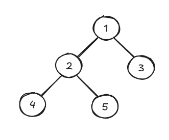

In tree traversal, **DFS** is used to explore each node by diving deep into one branch before backtracking. There are three main types of **DFS** traversal for trees:

1. **In-order Traversal**: Recursively visit the left subtree, then visit the root, and finally the right subtree. For the tree above, in-order traversal will visit the nodes in this order: `4 2 5 1 3`.

2. **Pre-order Traversal**: Visit the root first, then recursively visit the left subtree, followed by the right subtree. For the tree shown above, pre-order traversal will visit the nodes in this order: `1 2 4 5 3`.

3. **Post-order Traversal**: Recursively visit the left subtree, then the right subtree, and visit the root last. For the tree above, post-order traversal will visit the nodes in this order: `4 5 2 3 1`.

Note that when solving problems with these traversal methods, you will have to choose which method is best for each particular problem.

### Example: In-order Traversal

Let's perform an in-order tree traversal on the tree shown in the image above. The order the nodes will be visited in this traversal is: `4 2 5 1 3`.

1. In an in-order tree traversal, we always start by recursively exploring the left subtree of the root node until we arrive at a node which has no children (a leaf node). So, we first explore the left subtree of the root node `1`.

   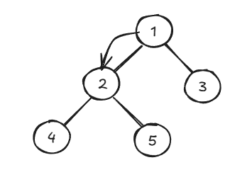

2. Next, we explore the left subtree of the node `2`.

   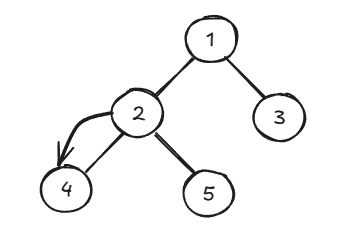

3. Now, we arrive at the leaf node `4`. Since `4` is a leaf node (it has no children), we visit it and backtrack to its root.

   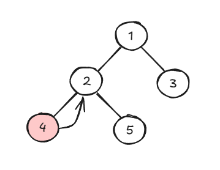

4. After traversing its left subtree, we can visit the root node `2` and explore its right subtree.

   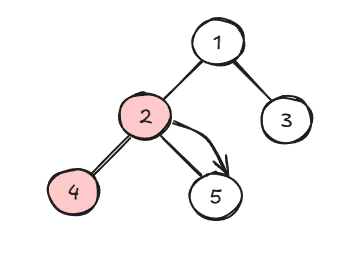

5. Moving down the right subtree of `2`, we visit the node `5`. This node is a leaf node, so we visit it and backtrack all the way to the root of the tree.

   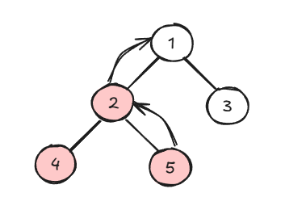

6. At the root of the tree, we visit the node `1` and continue by exploring its right subtree.

   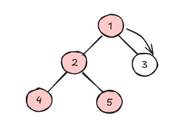

7. The right child of `1` is a leaf node with the value `3`, so we visit it and backtrack. Now, the **DFS** in-order traversal of the tree is complete.

   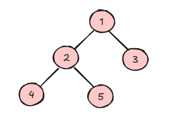

### Example: Pre-order Traversal

Let's perform a pre-order tree traversal on the example tree above. In a pre-order traversal, the nodes will be visited in this order: `1 2 4 5 3`.

1. Since we are performing a pre-order traversal, we first visit the root node `1`.

   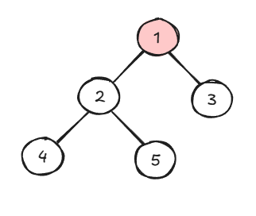

2. Next, we recursively traverse the left subtree and visit its root. In this case, the left subtree has a root of `2`.

   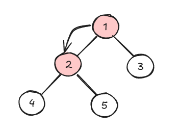

3. We continue traversing the left subtree, which has a root of `4`. Since this node is a leaf (it has no children), we visit it and backtrack.

   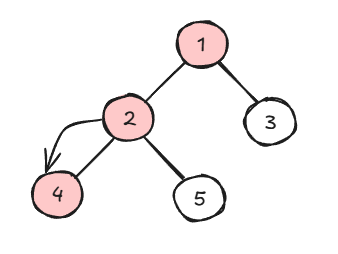

4. Next, we traverse the right subtree of the previous root (which is `2`). The root node of the right subtree is `5`. We visit this node and backtrack all the way up the tree from nodes `2 -> 1`.

   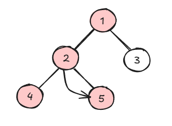

5. Now, we explore the right subtree of the tree's root node. The root of the right subtree is `3`. This node has no children, so we backtrack to the root node (`1`). We have now visited every node in the tree, and our **DFS** pre-order traversal is complete.

   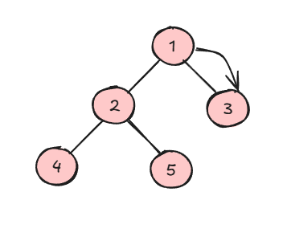

### Example: Post-order Traversal

Let's perform a post-order traversal on the same tree as in the previous examples. In a post-order traversal, the nodes will be visited in this order: `4 5 2 3 1`.

1. In post-order traversal, we visit a node's children before visiting the parent node. Starting at the root node `1`, we first explore the left subtree.

   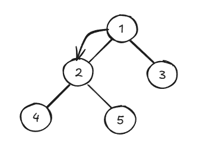

2. The left child of `1` is the node `2`, and which also has a left child. Continuing our post-order traversal, we traverse down the left subtree.

   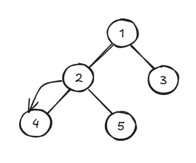

3. The left child of `2` is `4`, which has no children, so we visit this node and then backtrack to its parent node `2`.

   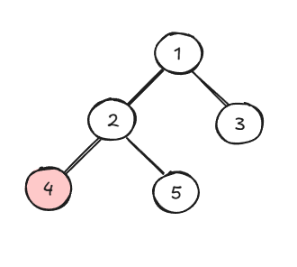

4. From the node `2`, we now visit the right child `5`.

   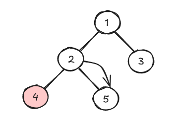

5. The current node `5` has no children, so we visit the node and backtrack.

   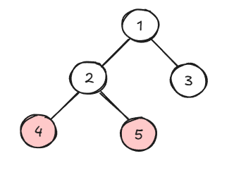

6. At the node `2`, since we have visited both of its children, we can visit this node and continue backtracking.

   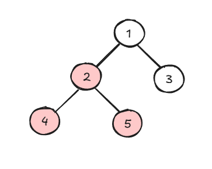

7. From the tree's root node `1`, we now explore its right subtree.

   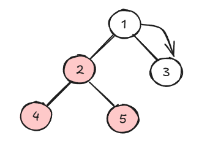

8. The right child of `1` is `3`, which has no children, so we visit it and backtrack.

   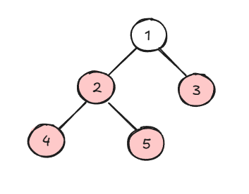

9. Finally, we can visit the tree's root node `1` since we have fully explored both its left and right subtrees. Our post-order traversal is now complete.

   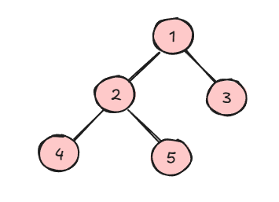

### Recursive Implementations (Python)

```python
class TreeNode:
    def __init__(self, value):
        self.value = value
        self.left = None
        self.right = None

# Recursive DFS (Pre-order Traversal)
def dfs_preorder_recursive(node):
    if node is None:
        return

    # Visit the root
    print(node.value, end=' ')

    # Recursively visit the left subtree
    dfs_preorder_recursive(node.left)

    # Recursively visit the right subtree
    dfs_preorder_recursive(node.right)

# Recursive DFS (In-order Traversal)
def dfs_inorder_recursive(node):
    if node is None:
        return

    # Recursively visit the left subtree
    dfs_inorder_recursive(node.left)

    # Visit the root
    print(node.value, end=' ')

    # Recursively visit the right subtree
    dfs_inorder_recursive(node.right)

# Recursive DFS (Post-order Traversal)
def dfs_postorder_recursive(node):
    if node is None:
        return

    # Recursively visit the left subtree
    dfs_postorder_recursive(node.left)

    # Recursively visit the right subtree
    dfs_postorder_recursive(node.right)

    # Visit the root
    print(node.value, end=' ')
```

### Iterative Implementations (Python)

```python
class TreeNode:
    def __init__(self, value):
        self.value = value
        self.left = None
        self.right = None

# Iterative DFS (Pre-order Traversal)
def dfs_preorder_iterative(root):
    if root is None:
        return

    stack = [root]

    while stack:
        node = stack.pop()
        print(node.value, end=' ')

        # Push right child first, so that left is processed first
        if node.right:
            stack.append(node.right)
        if node.left:
            stack.append(node.left)

# Iterative DFS (In-order Traversal)
def dfs_inorder_iterative(root):
    if root is None:
        return

    stack = []
    current = root

    while current is not None or stack:
        # Reach the leftmost node of the current node
        while current is not None:
            stack.append(current)
            current = current.left

        # Current is None, so we pop the top element
        current = stack.pop()
        print(current.value, end=' ')

        # We now visit the right subtree
        current = current.right

# Iterative DFS (Post-order Traversal)
def dfs_postorder_iterative(root):
    if root is None:
        return

    stack = []
    result = []  # Use a result list to store the post-order sequence
    stack.append(root)

    while stack:
        node = stack.pop()
        result.append(node.value)

        # Push left child first, so that right is processed first
        if node.left:
            stack.append(node.left)
        if node.right:
            stack.append(node.right)

    # The result is in reverse post-order, so we reverse it before printing
    print(' '.join(map(str, result[::-1])))
```

## DFS for Graph Traversal

### Example

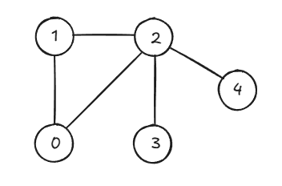

Let's use **DFS** to traverse the graph shown above, which can also be represented using an adjacency list, which maps nodes in the graph to their adjacent nodes, as shown below. For the sake of this example, let's start at node `1`.

```python
graph = {
    0: [1, 2],   # Node 0 is connected to nodes 1 and 2
    1: [0, 2],   # Node 1 is connected to nodes 0 and 2
    2: [0, 1, 3, 4],  # Node 2 is connected to nodes 0, 1, 3, and 4
    3: [2],      # Node 3 is connected to node 2
    4: [2]       # Node 4 is connected to node 2
}
```

1. First, we start at the node `1` and mark it as visited. We can pick any node adjacent to `1` to move to. For the sake of this example, let's choose `0`.

   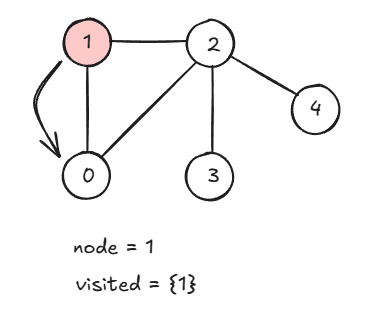

2. Then, we repeat the process by visiting the node `0` and picking an adjacent unvisited node to visit next. In this case, our only choice is `2`.

   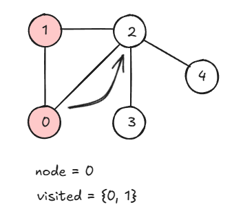

3. We move to node `2` and mark it as visited. From here, we must choose another adjacent unvisited node. Since we already visited nodes `0` and `1`, we choose `3`.

   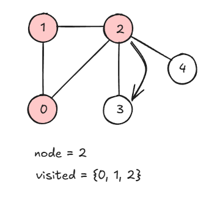

4. Now, we visit node `3`. Since there are no adjacent nodes to visit next, we backtrack to node `2`.

   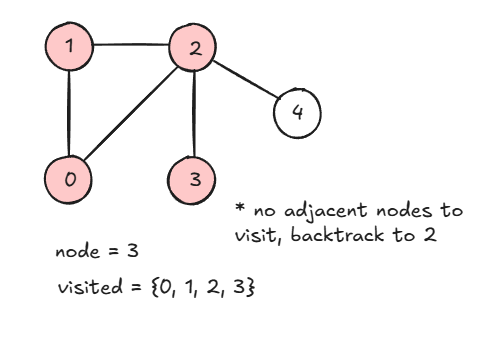

5. Back at node `2`, our only choice is to visit the node `4`.

   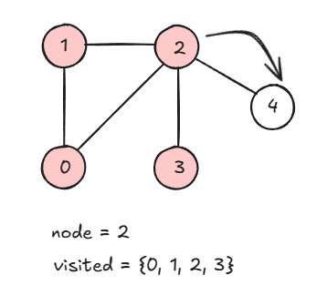

6. We visit node `4`, and our DFS traversal of the graph is complete.

   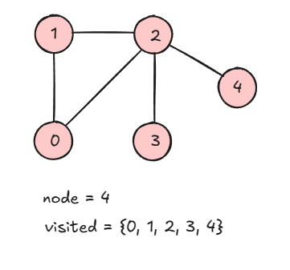

### Recursive Implementation (Python)

```python
def dfs_recursive(graph, node, visited=None):
    if visited is None:
        visited = set()

    # Mark the node as visited
    visited.add(node)
    print(node, end=' ')

    # Explore each adjacent node
    for neighbor in graph[node]:
        if neighbor not in visited:
            dfs_recursive(graph, neighbor, visited)

# Example usage
graph = {
    0: [1, 2],
    1: [3],
    2: [4],
    3: [],
    4: []
}

dfs_recursive(graph, 0)  # Output: 0 1 3 2 4
```

The recursive implementation of **DFS** is typically more intuitive and easier to implement but may run into issues with deep recursion due to stack overflow if the graph is very large.

### Iterative Implementation (Python)

```python
def dfs_iterative(graph, start):
    visited = set()
    stack = [start]

    while stack:
        node = stack.pop()

        if node not in visited:
            print(node, end=' ')
            visited.add(node)

            # Add neighbors to the stack
            for neighbor in reversed(graph[node]):
                if neighbor not in visited:
                    stack.append(neighbor)

# Example usage
graph = {
    0: [1, 2],
    1: [3],
    2: [4],
    3: [],
    4: []
}

dfs_iterative(graph, 0)  # Output: 0 1 3 2 4
```

The iterative implementation of **DFS** uses an explicit stack instead of recursion, which avoids recursion depth issues and can be more flexible in certain cases.

## Characteristics of DFS

- **Works for Graphs & Trees**: **DFS** can be applied to both tree structures and graphs, but for graphs, you need to mark nodes as visited to avoid revisiting nodes (which can lead to cycles).

- **Explores Deep Before Wide**: As its name suggests, **Depth First Search** explores a path to its deepest point before backtracking to explore other branches. This is in contrast to **Breadth First Search (BFS)**, which explores all neighbors of a node before moving deeper.

- **Iterative or Recursive Implementation**: **DFS** is commonly implemented using recursion, but it can also be implemented iteratively using the stack data structure.

- **Useful for Graph Traversal Problems**: **DFS** is commonly used for:

  - Finding connected components.
  - Detecting cycles in graphs.
  - Topological sorting in Directed Acyclic Graphs (DAGs)
  - Solving puzzles like mazes and the "knight's tour" problem.

- **Uses Backtracking**: **DFS** naturally supports backtracking, making it useful for solving constraint problems and exploring _all possible solutions_ in a search space.

- **Efficient for Sparse Graphs**: Since **DFS** only visits each vertex and edge once, it is efficient for traversing sparse graphs.

## References

- [Geeks for Geeks - Depth First Search or DFS for a Graph](https://www.geeksforgeeks.org/depth-first-search-or-dfs-for-a-graph/)
- [Geeks for Geeks - DFS Traversal of a Tree](https://www.geeksforgeeks.org/dfs-traversal-of-a-tree-using-recursion/)
