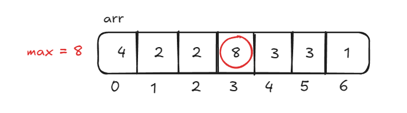
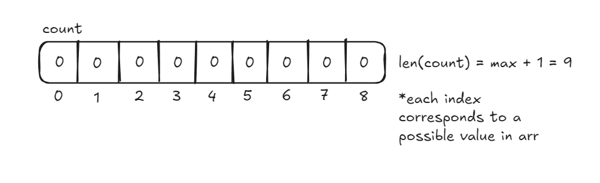
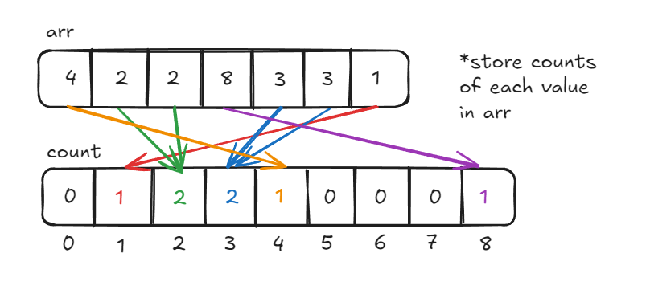
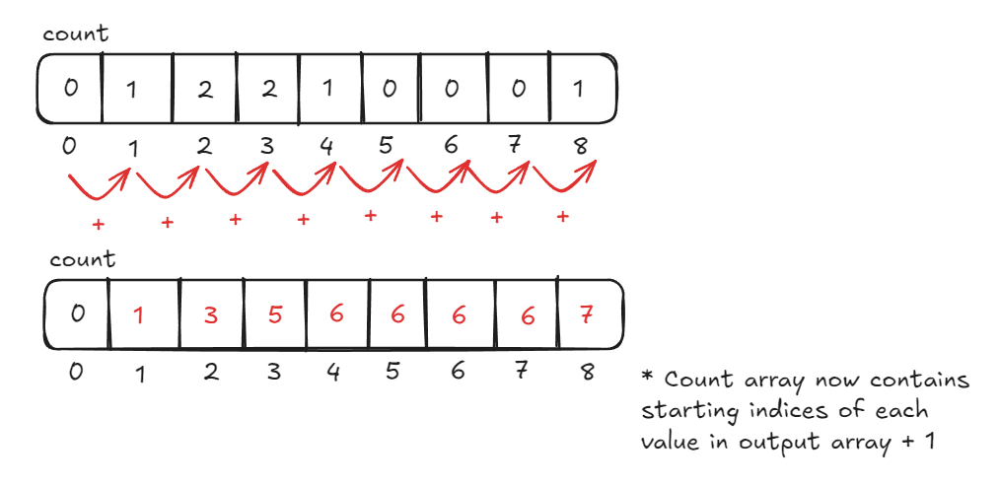
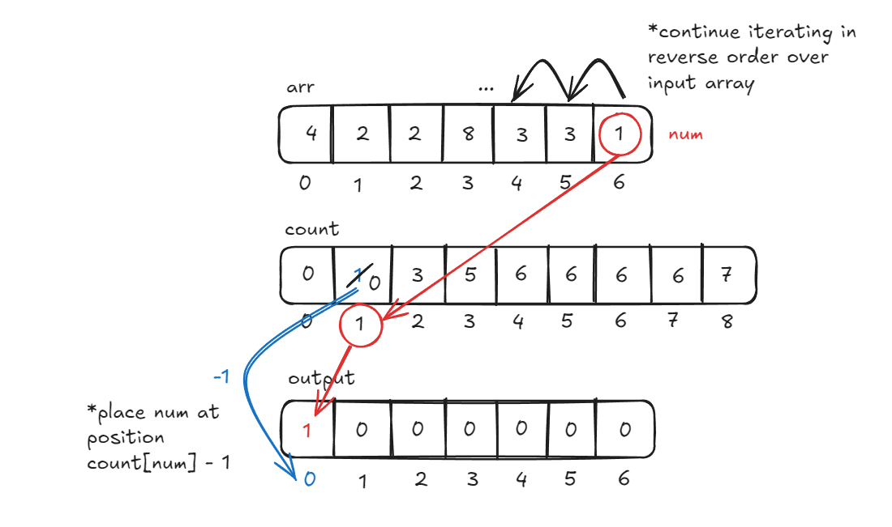
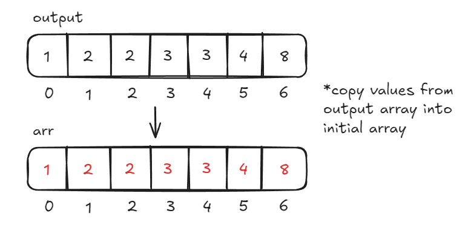

# Counting Sort

**Counting Sort** is a non-comparison-based sorting algorithm that sorts elements by counting their occurrences in an auxiliary array (count array). It works by finding the range of input values, counting how many times each value appears, and then using this information to place the elements in the correct order. **Counting Sort** is particularly efficient for sorting integers or objects that can be mapped to non-negative integers within a small range.

The steps of **Counting Sort** can be summarized as follows:

1. **Find the Maximum Value**: Identify the maximum value in the input array.
2. **Initialize Count Array**: Create a count array where each index corresponds to a possible value from the input array. The size of this count array is based on the maximum value in the input array.
3. **Count Occurrences**: Traverse the input array and update the count array by counting how many times each value appears.
4. **Accumulate Counts**: Update the count array so that each index contains the cumulative count of elements up to that index. This step helps in placing elements directly in their sorted position.
5. **Build the Output Array**: Traverse the input array in reverse order, using the count array to place each element in its correct position in the output array. After placing each element, decrement its count in the count array.
6. **Copy the Output Array**: Copy the sorted array back into the original array.

## Time & Space Complexity

| Complexity       | Big O Notation |
| ---------------- | -------------- |
| Time Complexity  | $O(n+k)$       |
| Space Complexity | $O(n+k)$       |

### Explanation

- **Time Complexity**: The time complexity of **Counting Sort** is $O(n+k)$, where $n$ is the number of elements in the input array, and $k$ is the range of the input values. Initializing the count array, counting occurrences, placing elements into the output array, and copying elements into the input array are all operations that take $O(n)$ time. Building the cumulative count takes $O(k)$ time. Combining these operations results in the time complexity of $O(n+k)$.
- **Space Complexity**: The space complexity of **Counting Sort** is $O(n+k)$, where $n$ is the number of elements in the input array and $k$ is the range of input values. We need a count array of size $k$ to store the frequency of each element in the input array and another array of size $n$ as our output array to store the sorted elements, resulting in a final space complexity of $O(n+k)$.

## Example

Let's use **Counting Sort** to sort the array `arr = [4, 2, 2, 8, 3, 3, 1]`.

### Step 1: Find the Maximum Value

The maximum value in our input array `arr` is `8`. We will store this value and use it in the next step.



### Step 2. Initialize Count Array

Next, we create a count array of size `9` (`max + 1`) to store the counts of each value in the input array. We can initialize this array containing all `0` values. So, we create an array `count = [0, 0, 0, 0, 0, 0, 0, 0, 0]`.



### Step 3. Count Occurrences

Now, we have to iterate over the input array and count the occurences of each element. We will store these counts in the `count` array we initialized previously. After traversing the input array and incrementing values in the count array, our count array will look like this: `count = [0, 1, 2, 2, 1, 0, 0, 0, 1]`. This indicates that `1` occurs once, `2` occurs twice, `3` occurs twice, `4` occurs once, and `8` occurs once.



### Step 4. Accumulate Counts

After counting the occurrences of each value, we must update the count array to contain the cumulative counts. After doing this, the count array will look like this: `count = [0, 1, 3, 5, 6, 6, 6, 6, 7]`. Now, the value at each index shows where the corresponding element should go in the output array. In other words, we determine each digit's starting position by counting how many cells are taken up by the digits before it, and update the `count` array to reflect this.



### Step 5. Build the Output Array

Now, we traverse the input array in reverse order and place each element we encounter in its sorted position in the `output` array. Our sorted `output` array will look like this: `output = [1, 2, 2, 3, 3, 4, 8]`.



### Step 6. Copy the Output Array

The final step is to copy the values in the output array to the input array, which gives us the sorted array. Now, `arr = [1, 2, 2, 3, 3, 4, 8]`.



## Implementation

```python
def counting_sort(arr):
    # Step 1: Find the maximum value in the array
    max_val = max(arr)

    # Step 2: Initialize count array with size max_val + 1
    count = [0] * (max_val + 1)

    # Step 3: Count the occurrences of each element
    for num in arr:
        count[num] += 1

    # Step 4: Accumulate the count array (optional for simple counting sort)
    for i in range(1, len(count)):
        count[i] += count[i - 1]

    # Step 5: Build the output array
    output = [0] * len(arr)
    for num in reversed(arr):  # Traverse input array in reverse to maintain stability
        output[count[num] - 1] = num
        count[num] -= 1

    # Step 6: Copy the sorted elements back to the original array
    for i in range(len(arr)):
        arr[i] = output[i]
```

## Characteristics of Counting Sort

1. **Efficient for Limited Range of Integers**: **Counting Sort** is particularly efficient when sorting numbers that fall within a small, known range, such as integers. However, it is less effective if the range $k$ is large compared to the number of elements $n$.

2. **Stable Sorting**: **Counting Sort** is a stable sorting algorithm, meaning it preserves the relative order of equal elements in the input array.

3. **Not a Comparison-Based Sort**: Unlike many other sorting algorithms, **Counting Sort** does not rely on directly comparing the value of elements, allowing it to achieve linear time complexity in some cases.

4. **Requires Extra Space**: **Counting Sort** requires extra space for the `count` and `output` arrays, making it space-inefficient when the range $k$, is large compared to the number of elements $n$.

## References

- [Geeks for Geeks Counting Sort – Data Structures and Algorithms Tutorials](https://www.geeksforgeeks.org/counting-sort/)
