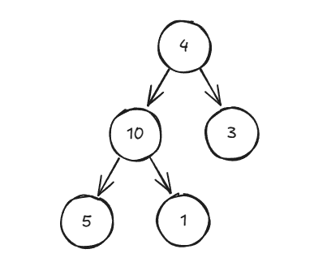

# Heap Sort

**Heap Sort** is a comparison-based sorting algorithm that uses inherent properties of the [Binary Heap](https://www.geeksforgeeks.org/binary-heap/) data structure to sort elements. Specifically, **Heap Sort** uses a Max Heap to repeatedly extract the largest elements from the heap and sort them in ascending order.

**Heap Sort** works by first converting the input array into a max heap, then repeatedly swapping the largest elements (the root of the heap) with the last unsorted element in the array, and reducing the heap size. This process is repeated until all elements are sorted.

**Heap Sort** can be summarized in the following steps:

1. **Build Max Heap**: Convert the input array to a max heap.
2. **Extract Maxiumum Element**: Swap the root element with the last element in the heap and reduce the heap size by one.
3. **Heapify Root Element**: Restore the max heap property in the reduced heap.
4. **Repeat Steps 2 & 3**: Continue extracting the maximum elements until the heap us reduced to a single element.

## Time & Space Complexity

| Complexity       | Big O Notation |
| ---------------- | -------------- |
| Time Complexity  | $O(n\ log(n))$ |
| Space Complexity | $O(1)$         |

### Explanation

- **Time Complexity**: **Heap Sort** has a time complexity of $O(n\ log(n))$ in all cases (best, average, and worst). The algorithm involves building the heap in $O(n)$ time and performing $n$ heapify operations, each taking $log(n)$ time, resulting in the time complexity of $O(n\ log(n))$.
- **Space Complexity**: Heap Sort has constant space complexity of $O(1)$, because it sorts the array in place and only requires a constant amount of extra space.

## Example

Let's use **Heap Sort** to sort the following array: `arr = [4, 10, 3, 5, 1]`. This array can be visualized as a binary tree:



### Step 1: Build the Max Heap

The first step of **Heap Sort** is to build a max heap from the input array. We start heapifying from the last non-leaf node, which is at index `n // 2 - 1`.

- Start from the last non-leaf node (`10` at index `1`), and since its subtree is already a max heap, no swapping is needed.

- Move up to the root node (`4` at index `0`). The root is smaller than its child (`10`), so we swap them and then call `heapify()` on the affected subtree:


### Step 2: Extract the Largest Element

Now that the array is a valid max heap with the largest element (`10`) at the root, we swap the root with the last element (`1`). The array now looks like this: `[1, 5, 3, 4, 10]`.

We reduce the heap size by one to exclude the sorted elements (`10`) and call `heapify()` on the new root to restore the max heap property:


### Step 3: Repeat Until Sorted

Repeat the extraction and heapify steps until the heap is reduced to a single element:

1. Swap the root (`5`) with the last unsorted element (`1`), resulting in `[1, 4, 3, 5, 10]`.

2. Reduce the heap size to `3` and call `heapify()` on the root:

   - Compare `1` with its children `4` and `3`.
   - `4` is the largest, so swap `1` with `4`. The array becomes `[4, 1, 3, 5, 10]`.

3. Repeat the steps:
   - Swap the root (`4`) with `3`, resulting in `[3, 1, 4, 5, 10]`.
   - Heapify `[3, 1]`, and since no changes are needed, the array remains `[3, 1, 4, 5, 10]`.
   - Finally, swap `3` with `1`, resulting in `[1, 3, 4, 5, 10]`.

After these steps, we obtain the sorted array: `arr = [1, 3, 4, 5, 10]`.

## Implementation (Python)

```python
# Helper function for heapifying subtree rooted at index i
def heapify(arr, n, i):
    # Assume the largest element is the root
    largest = i

    left = 2 * i + 1    # Left child index
    right = 2 * i + 2   # Right child index

    # Check if left child exists and is greater than root
    if left < n and arr[left] > arr[largest]:
        largest = left

    # Check if right child exists and is greater than root
    if right < n and arr[right] > arr[largest]:
        largest = right

    # If largest element is not the root, swap and continue heapifying
    if largest != i:
        arr[i], arr[largest] = arr[largest], arr[i]

        # Recursively heapify the affected subtree
        heapify(arr, n, largest)

# Main heap sort function
def heap_sort(arr):
    n = len(arr)

    # Build the Max Heap
    for i in range(n // 2 - 1, -1, -1):
        heapify(arr, n, i)

    # Extract largest elements from the heap one by one
    for i in range(n - 1, 0, -1):
        # Move current root (largest element) to the end of the array
        arr[i], arr[0] = arr[0], arr[i]

        # Call heapify on the reduced heap
        heapify(arr, i, 0)
```

## References

- [Geeks for Geeks Heap Sort - Data Structures and Algorithms Tutorials](https://www.geeksforgeeks.org/heap-sort/)
