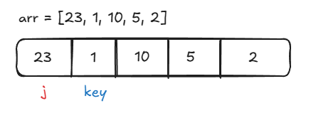
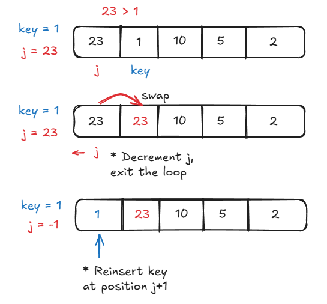
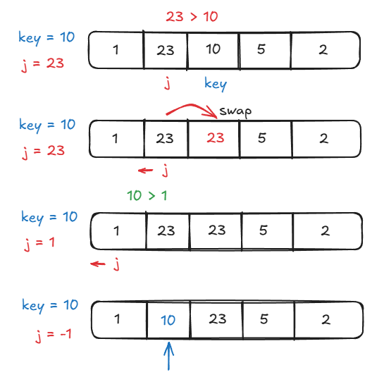

# Insertion Sort

**Insertion Sort** is a simple sorting algorithm that works by iteratively inserting elements of an unsorted array into their correct position in a sorted portion of the list. **Insertion Sort** is also a stable algorithm, which means that the relative order of equal elements in the unsorted array is preserved in the final sorted array.

A simple analogy to remember how **Insertion Sort** works is that it's like sorting playing cards in your hands. You split the cards into two groups: one group of sorted cards, and one group of unsorted cards. To sort all the cards in your hand, you choose a card from the unsorted group and place it in its correct position in the sorted group until all of the cards are sorted.

## Time & Space Complexity

| Complexity       | Best Case | Average Case | Worst Case |
| ---------------- | --------- | ------------ | ---------- |
| Time Complexity  | $O(n)$    | $O(n^2)$     | $O(n^2)$   |
| Space Complexity | $O(1)$    | -            | -          |

## Example

Let's use **Insertion Sort** to sort the following array: `arr = [23, 1, 10, 5, 2]`.

### Initial Setup

We begin the **Insertion Sort** algorithm by creating a variable called `key` at position `1` in `arr`.

### First Pass

On the first pass, we set `key = arr[1] = 1`, and we have a pointer `j` pointing to position `0` within arr, so `j = arr[0] = 23`. We compare `key` with `j`, and since `23 > 1`, we shift `23` to the right and decrement the `j` pointer. After decrementing `j`, the loop exits, and we insert `key` at position `j + 1`, which is position `0`. This changes the array to: `[1, 23, 10, 5, 2]`.

To summarize:

- `key = 1`
- `j = 23`
- Compare `1` with `23`:
  - `1 < 23`, so shift `23` to the right.
- Insert `1` in the first position
- Array after pass: `[1, 23, 10, 5, 2]`

### Second Pass

On the second pass, the position of key is incremented, so we have `key = arr[2] = 10`. Again, the pointer `j` is initialized at the position before `key`, so `j = arr[1] = 23`. We again compare the value of `key` to the value at `j`, and since `23 > 10`, we again shift `23` to the right and decrement the position of `j`. This makes `j = arr[0] = 1`. Now, we compare

### Third Pass

### Fourth Pass

## Implementation

## References
