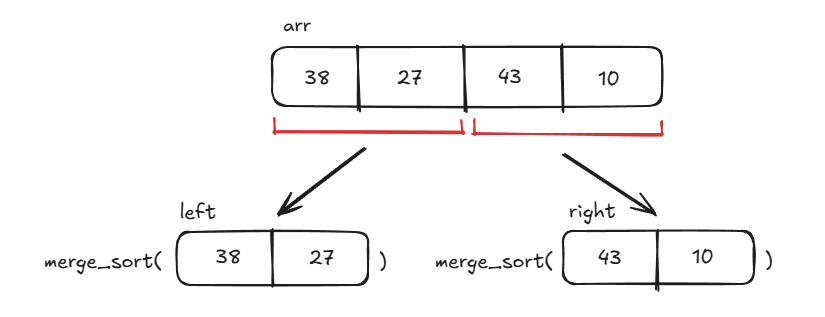
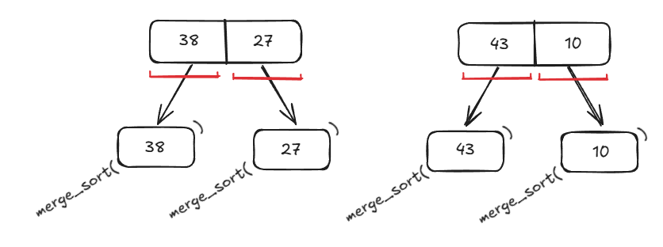
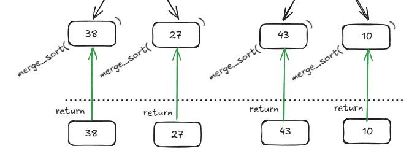
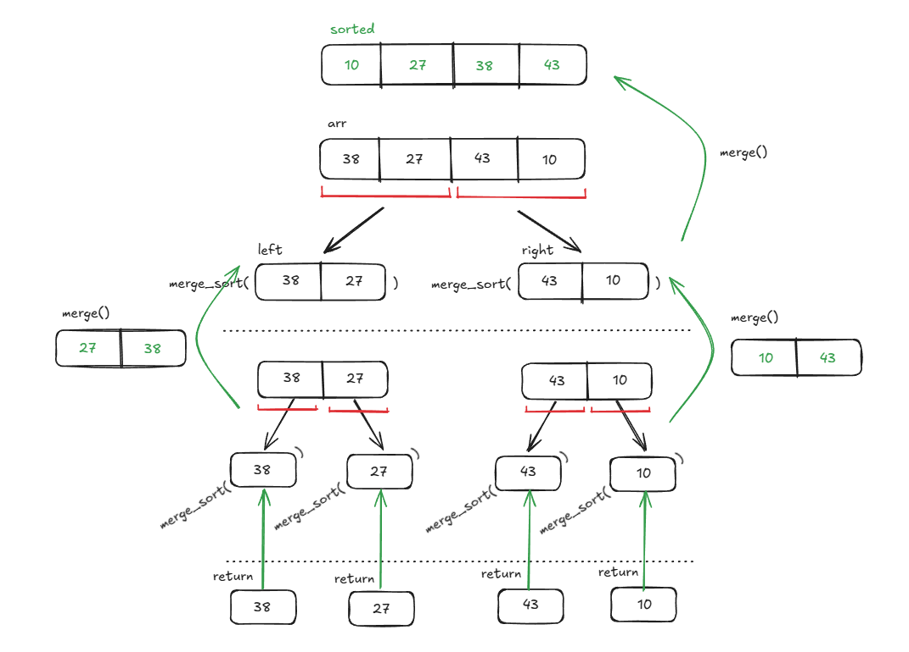

# Merge Sort

**Merge Sort** is a popular and efficient sorting algorithm that uses a divide-and-conquer approach. The algorithm typically works recursively by dividing the input array into smaller subarrays and sorting the subarrays before merging them back together to obtain the sorted array.

In simple terms, **Merge Sort** works by dividing an array in half, sorting each half, and then merging the two halves together repeatedly until the entire array is sorted.

Here are the steps that **Merge Sort** follows to sort an array:

1. **Divide**: Divide the array recursively in two halves until it can't be divided any further (down to the base case)
2. **Conquer**: Sort each subarray individually using the merge sort algorithm
3. **Merge**: Merge the sorted subarrays back together in sorted order. The process continues up the recursive call stack until all of the subarrays have been merged, resulting in the final sorted array.

## Time & Space Complexity

| Complexity       | Big O Notation |
| ---------------- | -------------- |
| Time Complexity  | $O(n\ log(n))$ |
| Space Complexity | $O(n)$         |

## Example

Let's use **Merge Sort** to sort the following array: `arr = [38, 27, 43, 10]`. Due to the algorithm's recursive nature, it's easier to visualize with a picture.

### First Recursive Call

In the function's first call, we divide the input array `arr` into two subarrays and recursively call `merge_sort()` on each subarray.



## Second Recursive Call

After calling `merge_sort()` on the original left and right subarrays, we again split each subarray into even smaller subarrays and call `merge_sort()` on each subarray.



## Third Recursive Call (Base Case)

After splitting each subarray down to only arrays containing single elements, we have reached the recursive base case of `merge_sort()`. Now, we return the single-element arrays and merge them as we traverse up the recursive call stack.



## Merge Subarrays

As we move up the recursive call stack, we call the `merge()` helper function to merge the subarrays returned from the previous recursive calls of `merge_sort()`. At each level, the subarrays are merged in sorted order until we eventually return the final sorted array.



## Implementation (Python)

```python
# Helper function for merging sorted subarrays
def merge(left, right):
    # Result array to store merged values
    result = []

    # Initialize array pointers for left and right subarrays at 0
    i = j = 0

    # Iterate over subarrays to compare elements & append to result in ascending order
    # Exit loop once we've completely iterated over the left or right subarray
    while i < len(left) and j < len(right):
        if left[i] < right[j]:
            result.append(left[i])
            i += 1
        else:
            result.append(right[j])
            j += 1

    # Append extra elements (if there are any) to the result array
    # This is necessary in case we have an odd number of total elements in left & right subarrays
    # e.g. merge([4], [5, 6])
    result.extend(left[i:])
    result.extend(right[j:])

    # Return the merged values
    return result

# Recursive function for applying merge_sort algorithm to an array
def merge_sort(arr):
    # Base case for recursion: length of arr == 1 or 0
    if len(arr) <= 1:
        return arr

    # Determine middle index for splitting into smaller subarrays
    mid = len(arr) // 2

    # Create temp arrays for storing left and right values
    left = arr[:mid]
    right = arr[mid:]

    # Sorted left and right subarrays
    sorted_left = merge_sort(left)
    sorted_right = merge_sort(right)

    # Merge sorted left and right subarrays as we move up the recursive call stack
    return merge(sorted_left, sorted_right)
```

## References

- [GeeksForGeeks Merge Sort – Data Structure and Algorithms Tutorials](https://www.geeksforgeeks.org/merge-sort/?ref=header_outind#illustration-of-merge-sort)
