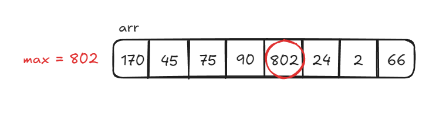
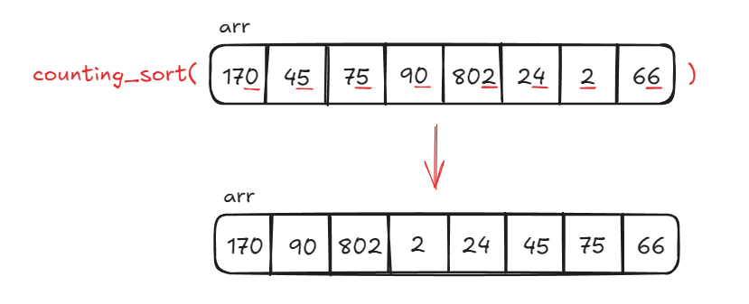
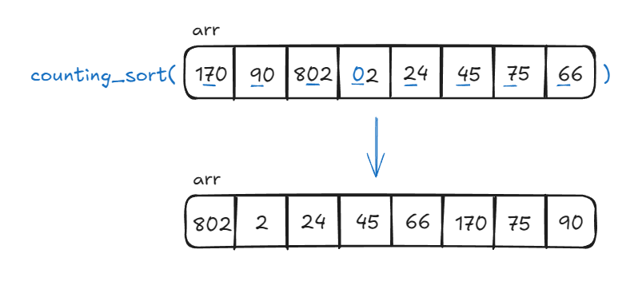
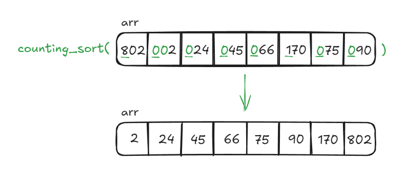

# Radix Sort

**Radix Sort** is a non-comparison-based sorting algorithm that sorts numbers by processing their individual digits. Instead of comparing elements directly like most sorting algorithms, **Radix Sort** sorts numbers digit by digit, starting from the least significant digit (LSD) to the most significant digit (MSD). This approach is especially efficient when sorting large lists of numbers with a similar number of digits.

The steps of **Radix Sort** can be summarized like this:

1. **Find the Maximum Element**: Find the number with the most digits in the array. This will determine how many iterations are required to process all the digits.
2. **Sort by Each Digit**: Starting from the LSD (the rightmost digit), group the numbers based on this digit. For each digit, use a stable sorting algorithm to ensure the order of numbers with the same digit is preserved.
3. **Move to the Next Significant Digit**: Once the numbers are sorted by the current digit, move to the next significant digit (the next digit to the left), and repeat the process.
4. **Repeat Until All Digits are Processed**: Continue sorting digit by digit until you've processed the most significant digit.

## Time & Space Complexity

| Complexity       | Big O Notation |
| ---------------- | -------------- |
| Time Complexity  | $O(d*(n+k))$   |
| Space Complexity | $O(n+k)$       |

### Explanation

- **Time Complexity**: The time complexity depends on $d$, the number of digits in the largest number, and $n$, the number of elements. The factor $k$ represents the range of digits (0-9 for decimal numbers). In practice, **Radix Sort** is $O(n)$ when sorting fixed-length integers. In other words, each pass of **Radix Sort** takes $O(n+k)$ time, and since we must perform $d$ passes, the total time complexity is $O(d*(n+k))$.
- **Space Complexity**: **Radix Sort** requires extra space proportional to the input size ($n$) and the range of digits ($k$).

## Example

Let's use **Radix Sort** to sort the array `arr = [170, 45, 75, 90, 802, 24, 2, 66]`.

### Step 1: Find Largest Element in `arr`

Find the largest element in the array, which is `802`. It has three digits, so we will perform three passes of **Radix Sort**, one pass for each significant digit.



### Step 2: Sort by Unit Place Digits

Sort the elements based on the LSD (the unit place) using a stable sorting technique, such as **Counting Sort**. This allows us to keep the keys in the same order as they appear in `arr`.

After performing **Counting Sort** on the unit place digits, the resulting array is `[170, 90, 802, 2, 24, 45, 75, 66]`.



### Step 3: Sort by Tens Place Digits

Next, we perform **Counting Sort** on the tens place digits. The resulting array from this operation is `[802, 2, 24, 45, 66, 170, 75, 90]`.

**Note**: Elements that don't have a number in the tens place use `0` as a placeholder, e.g. the element `2` should be treated as `02`. The same goes for later iterations of **Radix Sort** as we move on to greater significant digits.



### Step 4: Sort by Hundreds Place Digits

Finally, we perform the final pass of **Counting Sort** on the hundreds place digits to obtain the sorted array. The final sorted array is `[2, 24, 45, 66, 75, 90, 170, 802]`.



## Implementation

```python
# Helper function to perform Counting Sort based on specific digit (exp)
def counting_sort(arr, exp):
    n = len(arr)
    output = [0] * n    # Output array to store sorted numbers based on current digit
    count = [0] * 10    # Count array to store count of each digit

    # Count occurrences of each digit in given position (exp)
    for i in range(n):
        index = (arr[i] // exp) % 10    # Extract digit at current place value
        count[index] += 1   # Increment digit count

    # Update count array so it contains actual positions of digits in output
    for i in range(1, 10):
        count[i] += count[i - 1]    # Adjust count[i] to hold the actual position in output array

    # Build the output array by placing elements in their correct positions
    for i in range(n - 1, -1, -1):  # Traverse array in reverse order to maintain stability
        index = (arr[i] // exp) % 10    # Get digit at current place value
        output[count[index] - 1] = arr[i]   # Place element at correct position in output array
        count[index] -= 1   # Decrease count for digit

    # Copy output array into original array
    for i in range(n):
        arr[i] = output[i]

# Main function to implement Radix Sort
def radix_sort(arr):
    # Find max number to get number of digits
    max_num = max(arr)

    # Perform Counting Sort for every digit
    exp = 1     # exp is current digit's place value (1 = units, 10 = tens, 100 = hundreds, etc.)
    while max_num // exp > 0:
        counting_sort(arr, exp)
        exp *= 10   # Move to next significant digit
```

## Characteristics of Counting Sort

1. **Efficient for Fixed-Length Numbers**: This algorithm is particularly efficient for sorting fixed-length numbers such as integers, phone numbers, or zip codes.

2. **Non-Comparison Sort**: **Radix Sort** does not rely on direct comparison of elements for sorting, making it more efficient than comparison-based sorting algorithms when the range of values is limited.

3. **Stable Sorting**: **Radix Sort** is a stable sorting algorithm that preserves the relative order of equal elements in the input array. This is especially important when sorting complex data with multiple keys (e.g. sorting by zip code then house number).

4. **Requires Auxiliary Sorting**: Radix Sort typically uses another stable sorting algorithm, like **Counting Sort** to sort digits at each significant place.

## References

- [Geeks For Geeks Radix Sort – Data Structures and Algorithms Tutorials](https://www.geeksforgeeks.org/radix-sort/)
