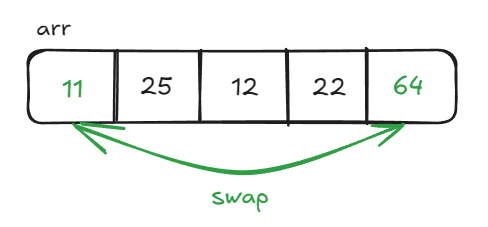
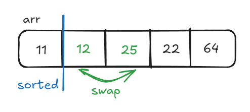
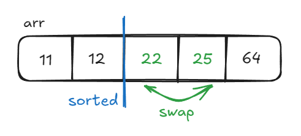
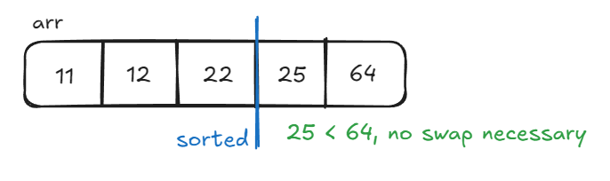
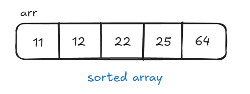

# Selection Sort

**Selection Sort** is a simple and efficient comparison-based sorting algorithm. It works by repeatedly iterating over the array, selecting the smallest element from the unsorted portion of the array, and moving it to its proper position in the sorted portion of the array.

Selection Sort can be summarized in the following steps:

1. **Start at First Element**: Start at the first position in the array. Initially, this is the first unsorted element.
2. **Find the Minimum Element**: Starting from the current postition, find the smallest element in the unsorted portion of the array.
3. **Swap the Minimum Element**: Swap the smallest element found with the first unsorted element.
4. **Repeat**: Increment the boundary between the sorted and unsorted portions of the array and repeat steps 2 and 3 until the entire array is sorted.

## Time & Space Complexity

| Complexity       | Big O Notation |
| ---------------- | -------------- |
| Time Complexity  | $O(n^2)$       |
| Space Complexity | $O(1)$         |

### Explanation

- **Time Complexity**: **Selection Sort** always has a time complexity of $O(n^2)$, because it involves two nested loops that iterate over the array's elements. On each pass, **Selection Sort** always iterates over every element in unsorted portion of the array.

- **Space Complexity**: **Selection Sort** sorts the array in-place, thus using only constant additional memory.

## Example

Let's walk through an example using **Selection Sort** to sort the array `arr = [64, 25, 12, 22, 11]`.

### 1. First Pass

On the first pass of **Selection Sort**, we start at the first position in the array and iterate over the remaining elements to find the minimum element. Iterating over all the remaining elements, we eventually find `11` at the end of the array. Since `11` is the smallest element, we swap it with the element in the first position. The resulting array is `[11, 25, 12, 22, 64]`.



### 2. Second Pass

On the second pass, we increment the starting position (to create the sorted portion of the array) and repeat the process for the remaining elements. Iterating over the unsorted elements, we find the minimum element `12` and swap it with the current position.



### 3. Third Pass

Once again, we increment the starting position and iterate over the unsorted portion to find the minimum element `22`. We swap it with the current element, `25`, since `22 < 25` and continue.



### 4. Fourth Pass

With only two remaining elements in the unsorted portion of the array, we compare `25` with `64`. Since `25 < 64`, no swap is necessary and we continue to the next pass.



### 5. Fifth Pass

On the final pass, **Selection Sort** has automatically placed the largest element at the end of the array, so the algorithm is complete, and the final sorted array is `[11, 12, 22, 25, 64]`.



## Implementation

```python
def selection_sort(arr):
    # Traverse the entire array
    for i in range(len(arr)):
        # Assume current element is the minimum
        mindex = i

        # Find the minimum element in the remaining unsorted partition
        for j in range(i + 1, len(arr)):
            if arr[j] < arr[mindex]:
                mindex = j

    # Swap the found minimum element with the first element of the unsorted portion
    arr[i], arr[mindex] = arr[mindex], arr[i]

```

## Key Points

- **Selection Sort** can alternatively be implemented by finding the _largest_ element in the array and swapping it into the _last_ position, but the overall process and result remains the same.

## References

- [Geeks for Geeks Selection Sort Algorithm](https://www.geeksforgeeks.org/selection-sort-algorithm-2/)
